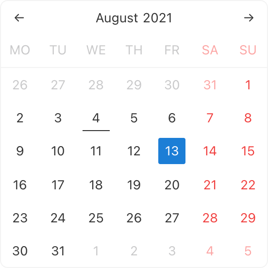

# @natscale/react-calendar    

A no dependencies, `lightweight` and feature-rich ⚡ calendar component for react.

> Note - The library is still under active development so the API might change before the first stable release. We do not recommend to use it in production.



[See Online Demo](natscale.github.io/react-calendar/).

> The demo page above is just a test page to be able to share the development progress with other people while it's in the beta phase. We are working on an official website for it.

## :books: Table of Contents

- [Installation](#package-installation)
- [Usage](#rocket-usage)
- [Support](#hammer_and_wrench-support)
- [Contributing](#memo-contributing)
- [License](#scroll-license)

## :zap: Features

- 🗓 **Date Range**
- 🗓 **Fixed Date Range**
- 🗓 **Multiple Dates**
- 🗓 **Highlight Custom Dates**
- 🗓 **Disable Custom Dates**
- 🦄 **Easy to Theme**
- ✅ **No Dependencies**
- 💻 **SSR Compatible**
- 🔩 **Easily Customizable**
- 🕊 **Lightweight** - _less than 20kb_

## :package: Installation

The calendar component uses react hooks so it requires the react version to be at least `16.8.0`. Make sure you have a react version that is equal to or greater than that.

#### With yarn

```sh
yarn add @natscale/react-calendar
```

#### With NPM

```sh
npm install @natscale/react-calendar
```

## :rocket: Usage

To add the default stylesheet. You can import it from the `node_modules` folder.

```ts
import '@natscale/react-calendar/dist/main.css';
```

#### With Typescript

```typescript
import React, { useState, useCallback } from 'react';
import { Calendar } from '@natscale/react-calendar';

function App() {
  const [value, setValue] = useState();

  const onChange = useCallback(
    (value) => {
      setValue(value);
    },
    [setValue],
  );

  return (
    <div>
      <Calendar value={value} onChange={onChange} />
    </div>
  );
}
```

#### With Javascript

```typescript
import React, { useState, useCallback } from 'react';
import { Calendar } from '@natscale/react-calendar';

function App() {
  const [value, setValue] = useState();

  const onChange = useCallback(
    (value) => {
      setValue(value);
    },
    [setValue],
  );

  return (
    <div>
      <Calendar value={value} onChange={onChange} />
    </div>
  );
}
```

## :memo: Motivation

The idea of creating a calendar component was a result of trying to find something online which could handle my requirements without needing me to hack away at the component's internals and possibly breaking it;

ergo, this react calendar which aims to be a one stop shop for every potential use case a web developer could think of when it comes to calendars and dates. All the featues I included are ones I thought would be most required from a calendar component. Any suggestions or updates are always welcome to make it more robust.

## :hammer_and_wrench: Support

Please [open an issue](https://github.com/natscale/react-calendar/issues/new) for support.

## :scroll: License

[MIT](LICENSE) © [Tushar Sharma](https://github.com/tusharf5/)
